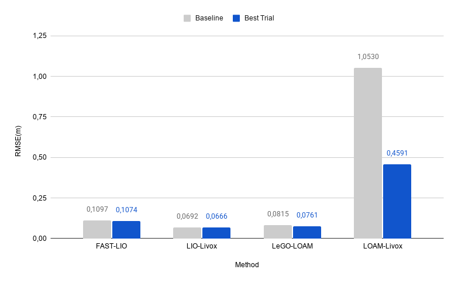
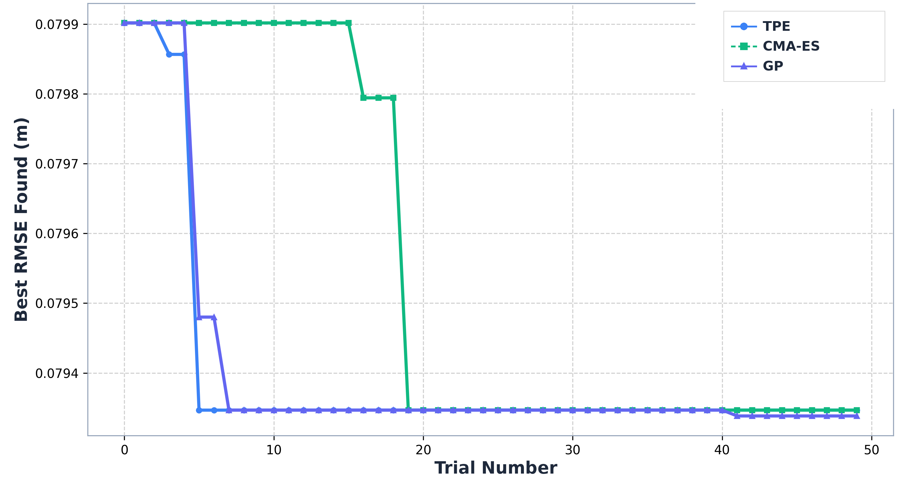
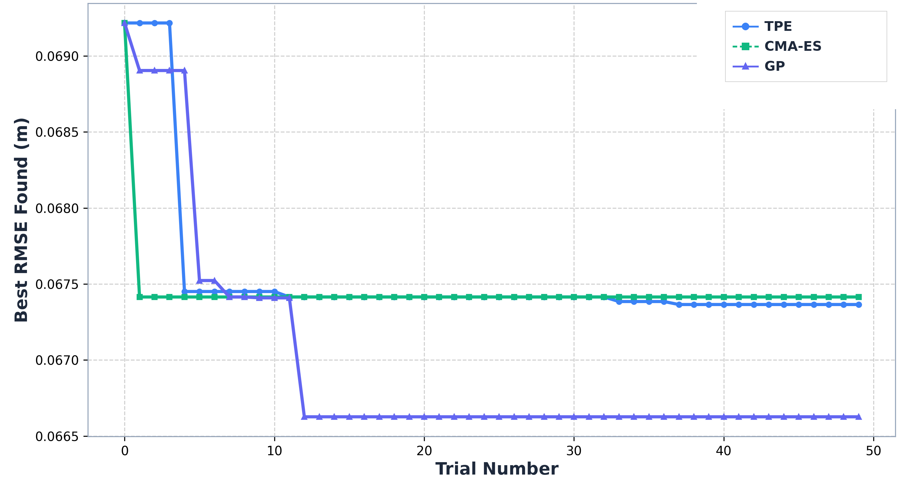

# SLAM LiDAR Benchmark with Optuna


A benchmarking pipeline for comparing LiDAR(-inertial) SLAM methods in forest environments, with automated hyperparameter optimization via [Optuna](https://optuna.org/). Built on ROS1 Melodic, running inside Docker.

## Demo

## Demo

<p align="center">
  
  <br>
  <em>Real-time trajectory estimation running on a forest dataset.</em>
</p>

<p align="center">
  
  <br>
  <em>Baseline vs. best-trial RMSE on TIERS-FOREST02. LOAM-Livox shows a significant 56.4% reduction, while tightly-coupled methods show marginal gains — illustrating the accuracy/robustness trade-off.</em>
</p>
<details>
<summary>More visuals</summary>

<!-- Add: docs/images/forest_environment.png -->
<p align="center">
  
  <br>
  <em>Dense canopy and robot trajectory from the <a href="https://github.com/tiers/tiers-lidars-dataset">TIERS LiDAR dataset</a>.</em>
</p>

<!-- Add: docs/videos/fast_lio_demo.mp4 (or link to an external host, e.g. YouTube, if the file is too large for git) -->
A longer screen recording of FAST-LIO running with RViz visualization is available at `docs/videos/fast_lio_demo.mp4`.

</details>

## Overview

This project evaluates multiple state-of-the-art SLAM methods on the same rosbag datasets, optimizing each method's hyperparameters with three different search strategies (TPE, CMA-ES, Gaussian Process), and comparing the results on:

- **Trajectory accuracy** (RMSE / Absolute Pose Error, via [evo](https://github.com/MichaelGrupp/evo))
- **Hyperparameter importance** (fANOVA)
- **Optimizer convergence** (best RMSE per trial)
- **Computational cost** (execution time, CPU usage, peak memory)

## Methods supported

| Method | Type | Config format |
|---|---|---|
| [FAST-LIO2](https://github.com/hku-mars/FAST_LIO) | Tightly-coupled | YAML (runtime) |
| [LIO-Livox](https://github.com/Livox-SDK/LIO-Livox) | Tightly-coupled | YAML (runtime, OpenCV FileStorage format) |
| [LeGO-LOAM](https://github.com/RobustFieldAutonomyLab/LeGO-LOAM) | Loosely-coupled | C++ header (compile-time) |
| [LOAM-Livox](https://github.com/hku-mars/loam_livox) | Loosely-coupled | YAML (runtime) |


## Results

Results below are from two real-world sequences of the [TIERS forest dataset](https://github.com/tiers/tiers-lidars-dataset): **TIERS-FOREST01** (closed-loop trajectory) and **TIERS-FOREST02** (near-straight-line trajectory). Each method was run with its default configuration (baseline) and with 50 trials per optimizer (TPE, CMA-ES, GP).

**RMSE — TIERS-FOREST01**

| Method | Baseline | Best Trial | Reduction |
|---|---|---|---|
| FAST-LIO2 | 0.1328 m | 0.1321 m | 0.5% |
| LIO-Livox | 0.0799 m | 0.0793 m | 0.8% |
| LeGO-LOAM | 0.1036 m | 0.0985 m | 4.9% |
| LOAM-Livox | 0.7779 m | 0.7193 m | 7.5% |

**RMSE — TIERS-FOREST02**

| Method | Baseline | Best Trial | Reduction |
|---|---|---|---|
| FAST-LIO2 | 0.1097 m | 0.1074 m | 2.1% |
| LIO-Livox | 0.0692 m | 0.0666 m | 3.8% |
| LeGO-LOAM | 0.0815 m | 0.0761 m | 6.6% |
| LOAM-Livox | 1.0530 m | 0.4591 m | **56.4%** |

Loosely-coupled methods consistently showed higher sensitivity to hyperparameter tuning than tightly-coupled ones, at the cost of a significant increase in execution time for the best-performing case (LOAM-Livox: +220% on TIERS-FOREST02). See the paper for the full fANOVA and computational-cost analysis.

<!-- Add: docs/images/convergence_curves.png -->
<p align="center">
  
  
  <br>
  <em>Convergence curves for TPE, CMA-ES, and GP, across method LIO-Livox and both datasets.</em>
</p>

* convergence curves for TPE, CMA-ES, and GP, across method LIO-Livox and both datasets.*

## Computational Cost

Improving RMSE is not free: hyperparameter optimization can shift the operating point of each method towards heavier processing, which matters for real-time or embedded deployment. Cost was measured with [`psutil`](https://github.com/giampaolo/psutil), sampling CPU and memory every second during execution.

**Baseline vs. best-trial cost — TIERS-FOREST02**

| Method | Execution time | Avg. CPU | Peak RAM |
|---|---|---|---|
| FAST-LIO2 | marginal (< 12%) | — | 2305.0 MB → 3192.0 MB |
| LIO-Livox | marginal (< 12%) | 161.5% → 46.4% | 804.4 MB → 1630.5 MB |
| LeGO-LOAM | marginal (< 12%) | — | ~350–360 MB (stable) |
| LOAM-Livox | 116.5 s → 372.9 s (**+220%**) | 167.9% → 59.8% | 2716.0 MB → 2702.7 MB (stable) |

> **Note:** Although the `liorf` repository is included in the workspace structure, it was not evaluated due to time constraints. Therefore, all results and metrics presented below reflect only the comparison between **FAST-LIO2, LIO-Livox, LeGO-LOAM, and LOAM-Livox**

The method with the largest accuracy gain (LOAM-Livox) is also the one with the steepest cost increase — its best-trial configuration runs at ~3.2x the baseline execution time, which would likely make it unsuitable for real-time operation despite the accuracy improvement. Interestingly, CPU utilization *drops* for both LIO-Livox and LOAM-Livox in their best trials, suggesting the optimized configurations trade parallelism for a leaner (though slower) execution — a relevant consideration for power-constrained embedded platforms. LeGO-LOAM keeps the leanest and most stable memory footprint across both datasets and configurations.

## Requirements

- Docker with a Linux container running **Ubuntu 18.04 + ROS1 Melodic**
- Python 3.6 (system) for the optimization pipeline, Python 2.7 for ROS-side scripts (`bag_to_tum.py`)
- catkin workspace built with `catkin_make` (not `catkin build` — the two are not interchangeable in this workspace)
- GTSAM ≥ 4.0 (built from source, required by LeGO-LOAM and liorf)
- Python packages: `optuna`, `scikit-optimize` (GP sampler), `psutil`, `pandas`, `matplotlib`, `plotly`, `fanova` (optional, for fANOVA — falls back to `MeanDecreaseImpurityImportanceEvaluator` if unavailable), `evo`

```bash
pip3 install optuna scikit-optimize psutil pandas matplotlib plotly fanova evo
```

## Project structure

```
.
├── Dockerfile
├── src/                        # catkin workspace (bind mount)
│   ├── FAST_LIO/
│   ├── livox_ros_driver/       # dependency of FAST_LIO, LIO-Livox, LOAM-Livox
│   ├── LIO-Livox/
│   ├── LeGO-LOAM/
│   ├── loam_livox/
│   └── liorf/
│
├── datasets/                   # NOT versioned — see .gitignore
│   ├── <dataset_name>.bag
│   └── ground_truth/
│       └── gt_<dataset_name>.tum
│
├── configs/                    # master configs, versioned outside src/
│   ├── fast_lio/ouster128.yaml
│   ├── lio_livox/horizon.yaml
│   ├── lego_loam/velodyne16_utility.h
│   ├── loam_livox/performance_realtime.yaml
│   └── liorf/lio_sam_ouster.yaml
│
├── methods/
│   └── registry.yaml           # describes every method: how to run it, odom topic, tunable params, search space
│
├── scripts/
│   ├── bag_to_tum.py           # (Python 2) generic: bag + topic -> .tum
│   ├── run_method.py           # generic: roscore + SLAM node + bag playback + resource monitoring
│   ├── evaluate.py             # (Python 3) generic: gt.tum + est.tum -> RMSE/APE + plot
│   ├── optuna_optimize.py      # generic: reads registry.yaml, optimizes any method
│   ├── run_full_benchmark.py   # runs all method x sampler combinations sequentially
│   ├── measure_cost.py         # re-runs baseline + best trial with resource monitoring
│   ├── plot_convergencia.py    # best-RMSE-so-far curve, per sampler
│   ├── plot_fanova.py          # hyperparameter importance (fANOVA), exported as HTML
│   ├── plot_custo_baseline_vs_best.py  # cost comparison chart (baseline vs. best trial)
│   └── report_best_trials.py   # text summary of top trials per method/sampler
│
└── results/
    └── <method>/<config>/<dataset>/
        ├── study_<sampler>.db      # NOT versioned — Optuna SQLite storage
        ├── study_<sampler>.csv     # trial history (params, RMSE, resource usage)
        ├── <sampler>/trial_XXXX/
        │   ├── config_used.yaml (or utility_used.h)
        │   ├── odom.tum             # NOT versioned
        │   ├── ape_stats.json
        │   └── baseline_ape.png     # only kept for record-breaking trials
        └── cost/
            ├── custo_<sampler>.json
            └── custo_baseline_vs_best_<sampler>.png
```

## Pipeline

```
dataset.bag ──▶ run_method.py (roslaunch + rosbag record/play) ──▶ odom.tum
                                                                       │
gt.tum ────────────────────────────────────────────────────────▶ evaluate.py ──▶ RMSE / APE
                                                                       │
                                                              optuna_optimize.py
                                                            (TPE / CMA-ES / GP, 50 trials)
```

Each trial: inject sampled hyperparameters into the method's config → run the SLAM node against the dataset → convert recorded odometry to TUM format → evaluate against ground truth → feed RMSE back to the optimizer.

## Usage

### 1. Add a new dataset

1. Copy the `.bag` file to `datasets/`.
2. Generate the ground truth `.tum` from the pose topic, named `gt_<dataset_name>.tum` (must match the `--dataset` argument used everywhere).
3. Determine `bag_duration_sec` (`rosbag info <bag>`).
4. For each method, run the baseline manually to compute `time_offset` (clock offset between the ground truth and the SLAM method's odometry) and calibrate `min_matched_poses` (used to discard trials with tracking failures).
5. Update `methods/registry.yaml` accordingly.

### 2. Run a single method/sampler

```bash
python3 scripts/optuna_optimize.py --method fast_lio --sampler tpe --trials 50 --dataset <dataset_name>
```

### 3. Run everything (all methods x all samplers)

```bash
nohup python3 scripts/run_full_benchmark.py --trials 50 --dataset <dataset_name> \
    > results/overnight_run.log 2>&1 &
```

### 4. Measure computational cost (baseline vs. best trial only)

```bash
python3 scripts/measure_cost.py --method fast_lio --sensor ouster128 --dataset <dataset_name> --sampler tpe
python3 scripts/plot_custo_baseline_vs_best.py --method fast_lio --sensor ouster128 --dataset <dataset_name> --sampler tpe
```

### 5. Generate analysis plots

```bash
python3 scripts/plot_convergencia.py --method fast_lio --sensor ouster128 --dataset <dataset_name>
python3 scripts/plot_fanova.py --method fast_lio --sensor ouster128 --dataset <dataset_name> --sampler tpe
python3 scripts/report_best_trials.py --dataset <dataset_name> --top-n 3
```

## Adding a new SLAM method

1. Clone the package into `src/`, compile with `catkin_make`.
2. Find the real odometry topic (`rostopic list` while playing a bag manually).
3. Copy the method's master config into `configs/<method>/`.
4. Add an entry to `methods/registry.yaml` (package, launch file, config type, tunable params, search space, baseline, time offset, `bag_duration_sec`, `min_matched_poses`).
5. Disable RViz in the launch file (comment out the `<node pkg="rviz" .../>` line) to avoid a window opening on every trial.
6. Test with a single trial before running the full 50.

## Known caveats

- **LOAM-Livox**: publishes odometry using wall-clock time (`ros::Time::now()`) rather than bag time, so `time_offset` must be computed dynamically on every run (set `time_offset: "dynamic"` in the registry) rather than fixed.
- **LeGO-LOAM**: hyperparameters are hardcoded in a C++ header and require a full `catkin_make --pkg lego_loam` recompilation on every trial — significantly slower than YAML-based methods.
- Docker Desktop / WSL2 environments have shown intermittent slowdowns (`roscore` failing to start in time) after long unattended runs; `run_method.py` includes automatic cleanup and a `SIGINT → SIGTERM → SIGKILL` shutdown escalation to mitigate this, along with retry logic in `optuna_optimize.py` for transient failures.
- `float('inf')` must never be returned as an Optuna trial value — it breaks the Gaussian Process sampler. Invalid trials are penalized with a large finite constant (`PENALIDADE_TRIAL_INVALIDO = 999.0`) instead.

## Citation

If you use this benchmark in your research, please cite the accompanying paper (details to be added upon publication).

## License

This project is licensed under the MIT License - see the [LICENSE](LICENSE) file for details.